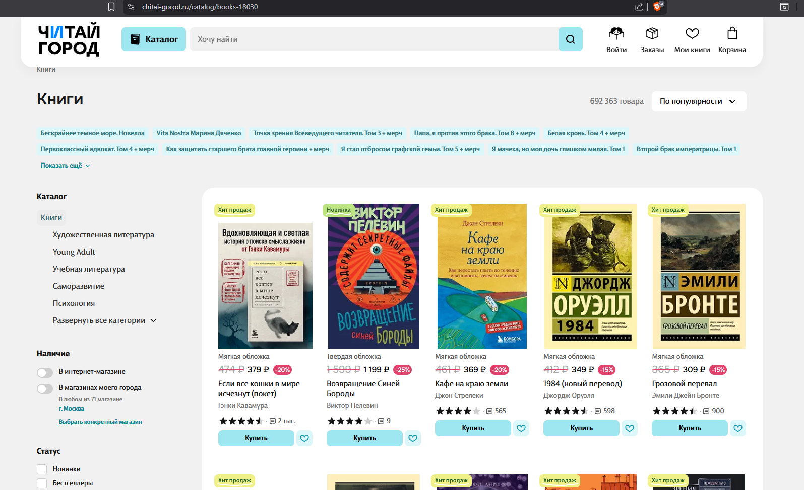
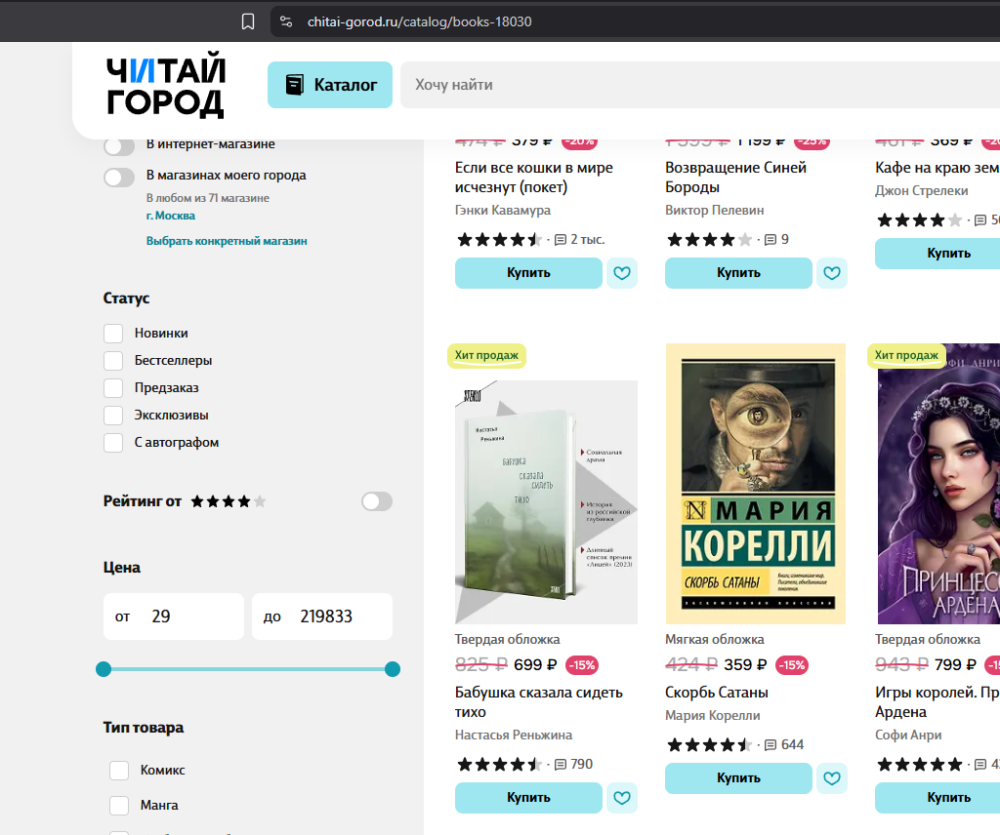
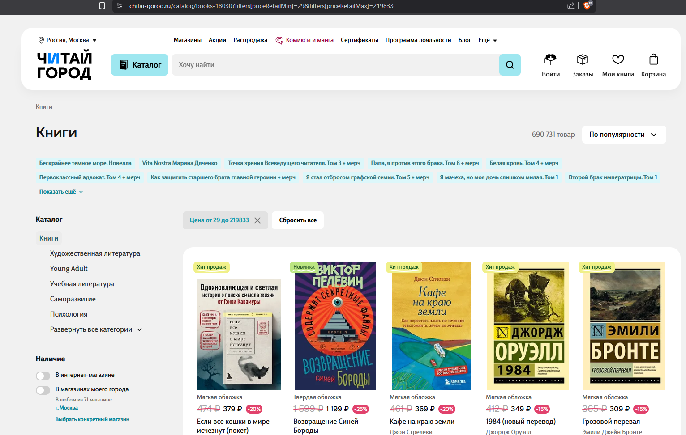

### Заголовок
\[Каталог\] Применение "Пустого" фильтра к цене меняет количество товаров
---

### Предусловия
Открыт [полный каталог книг](chitai-gorod.ru/catalog/books-18030)

---

### Шаги воспроизведения
1. Зафиксировать количество товаров
2. Сдвинуть ползунок в фильтре "Цена". Дождаться обновления страницы
3. Сдвинуть ползунки минимальной и максимальной цены в максимально широкое начальное положение.
---

### Фактический результат
После применения максимально широкого фильтра количество товаров отличается от начального без фильтров (692 363 товара без фильтра и 690 731 товар с фильтром)

---

### Ожидаемый результат
После применения максимально широкого фильтра количество товаров осталось прежним (692 363 на момент нахождения бага)

---

### Окружение
-   **Browser:** Brave 1.89.143 | 64 bit (Chromium 147.0.7727.117) 
-   **OS:** Windows 11

---

### Серьезность
Medium

---

### Приоритет
Medium 

---

### Дополнительная информация

Проблема указывает на проблему работы диапазона фильтра "Цена". Предположительно, книги, обладающие нестандартной ценой (например NULL или 0) не включаются в выборку фильтра и не учитываются при расчете диапазона.

### Вложения

