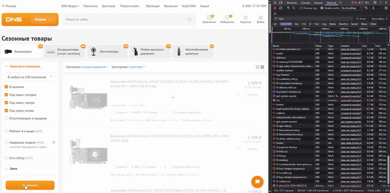

### Заголовок
\[Каталог\] Избыточные запросы при статичном состоянии фильтров
---

### Предусловия
Открыта категория товаров, например - ["Видеокарты"](https://www.dns-shop.ru/catalog/17a89aab16404e77/videokarty/)

---

### Шаги воспроизведения
1. Открыть DevTools, вкладку Network
2. При пустых фильтрах нажать кнопку "Применить"
---

### Фактический результат
Каждое нажатие создает множество новых запросов. Количество запросов зависит от товарной категории

---

### Ожидаемый результат
Нажатие на кнопку "Применить", когда состояние фильтров не изменилось, не инициируются новые сетевые запросы

---

### Окружение
-   **Browser:** Brave 1.89.143 | 64 bit (Chromium 147.0.7727.117) 
-   **OS:** Windows 11

---

### Серьезность
Minor

---

### Приоритет
Medium 

---

### Дополнительная информация

Проблема воспроизводится в разных категориях.
Например:
- Категория “Видеокарты”: ~19 запросов
- Категория “Процессоры”: ~15 запросов
- Категория “Вентиляторы”: ~20 запросов

### Вложения

