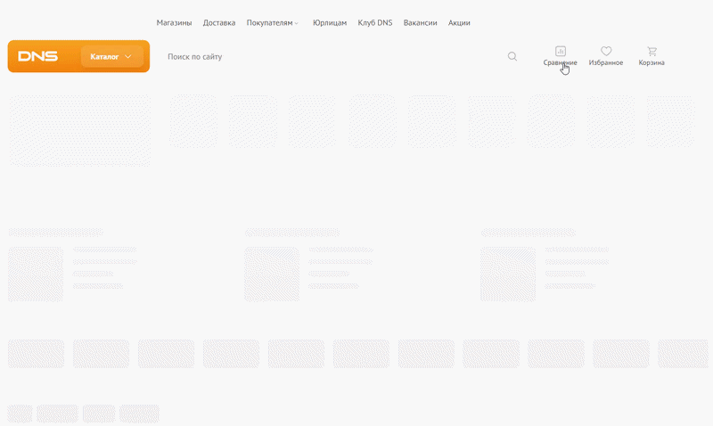

### Заголовок
\[Главная страница\] Отсутствие ссылки на корзину при выключенном JavaScript

---

### Предусловия
1. Выключен JavaScript
2. Открыта главная страница

---

### Шаги воспроизведения
Нажать на корзину

---

### Фактический результат
Ничего не происходит, корзина не кликабельна

---

### Ожидаемый результат
Происходит переход на страницу [корзины](https://www.dns-shop.ru/cart/)

---

### Окружение
-   **Browser:** Brave 1.89.143 | 64 bit (Chromium 147.0.7727.117) 
-   **OS:** Windows 11

---

### Серьезность
Minor

---

### Приоритет
Medium 

---

### Дополнительная информация

Неэквивалентное поведение элементов в верхней панели. "Сравнение" и "Избранное" являются кликабельными (ссылками `<a>`), а "Корзина" - нет (`
`).

### Вложения
