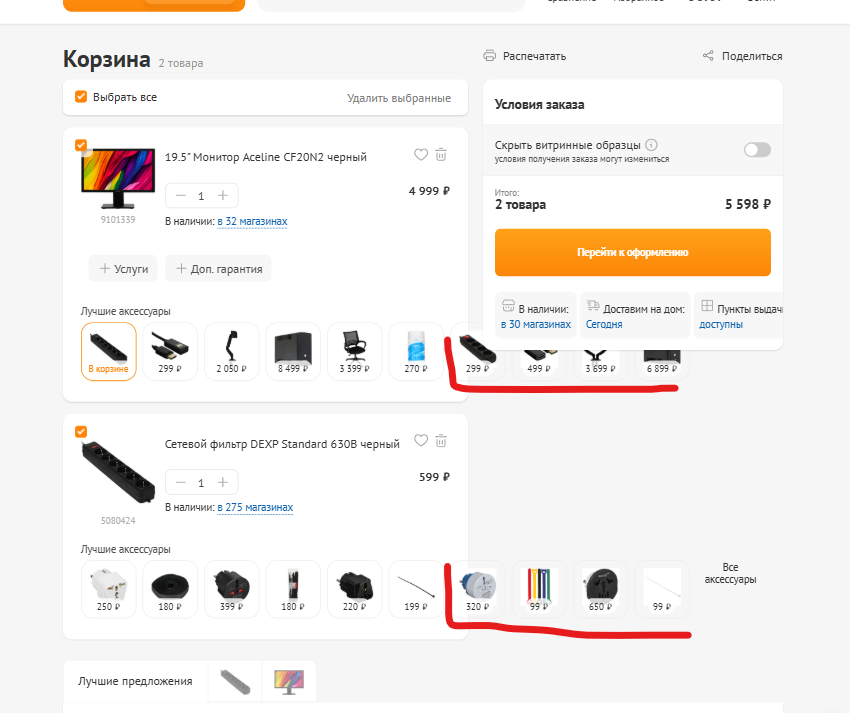

### Заголовок
\[Корзина\] Список элементов "Лучшие аксессуары" не адаптируется под количество элементов на планшетных разрешениях

---

### Предусловия
В корзине есть несколько товаров с большим количеством аксессуаров. Например комбинация [монитора](https://www.dns-shop.ru/product/8dac93069fa7bc31/195-monitor-aceline-cf20n2-cernyj/) и [сетевого фильтра](https://www.dns-shop.ru/product/c77316a950e7ed20/setevoj-filtr-dexp-standard-630b-cernyj/)

---

### Шаги воспроизведения
1. Перейти в корзину
2. Открыть DevTools
3. Включить "Переключить панель инструментов устройства" и установить ширину области просмотра в диапазоне с 992 до 1199 включительно
4. Обновить страницу

---

### Фактический результат
Элементы из блока “Лучшие аксессуары”, которые не помещаются в видимую область, не скрываются. Они выходят за границы родительского элемента

---

### Ожидаемый результат
Элементы которые не помещаются на экран, скрыты.

---

### Окружение
-   **Browser:** Brave 1.89.143 | 64 bit (Chromium 147.0.7727.117) 
-   **OS:** Windows 11

---

### Серьезность
Minor

---

### Приоритет
Medium 

---

### Дополнительная информация

Проблема видна в нестандартных разрешениях экрана, стандартные пресеты экранов DevTools не имеют этой проблемы. Выглядит как проблема расчета количества элементов в родительском элементе

### Вложения
