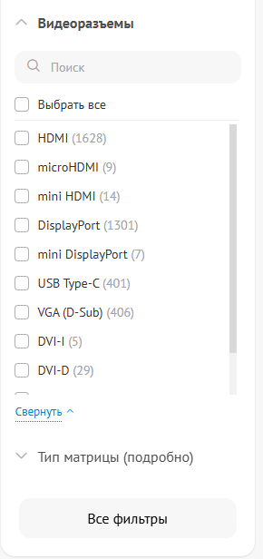
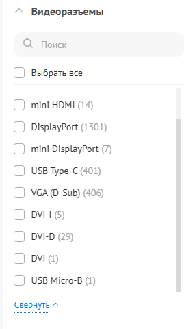
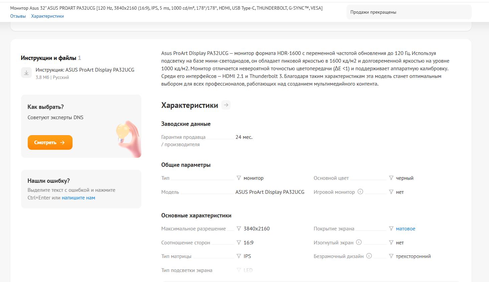

### Заголовок
\[Каталог\] Отсутствует "Thunderbolt" в списке фильтра видеоразъемов

---

### Предусловия
1. Открыт каталог ["Мониторы"](https://www.dns-shop.ru/catalog/17a8943716404e77/monitory/)

---

### Шаги воспроизведения
1. В панели фильтров слева найти блок "Видеоразъемы".

---

### Фактический результат
В списке доступных видеоразъемов отсутствует опция "Thunderbolt".

---

### Ожидаемый результат
В списке присутствует опция "Thunderbolt", так как в каталоге есть товары с этой характеристикой.

---

### Окружение
-   **Browser:** Brave 1.89.143 | 64 bit (Chromium 147.0.7727.117) 
-   **OS:** Windows 11

---

### Серьезность
Major

---

### Приоритет
Medium 

---

### Дополнительная информация

Проблема не позволяет пользователям найти все мониторы с Thunderbolt.

Характеристика "Thunderbolt" у таких товаров указана либо в текстовом описании, либо в поле "Другие разъемы", но не вынесена в отдельный атрибут для фильтрации.

**Обоснование серьезности (Major):**
Внутренний текстовый поиск по сайту не является обходным путем, так как при поиске по слову "Thunderbolt" сбивается категория каталога и релевантные мониторы не находятся. Единственный способ найти товар — использовать внешние поисковики (например, запрос "монитор Thunderbolt site:dns-shop.ru" в Google), что критично для UX и ведет к потере потенциальных покупателей.

**Анализ приоритета:**
Приоритет Medium обусловлен тем, что сейчас на сайте отсутствуют в продаже мониторы с Thunderbolt не от компании Apple. При появлении мониторов с таким видеоразъемом клиенту будет невозможно их найти через фильтр.

**Примеры товаров, которые невозможно найти через фильтры:**
-   Asus ProArt PA34VC
-   Lenovo ThinkVision P32u-10

### Вложения

